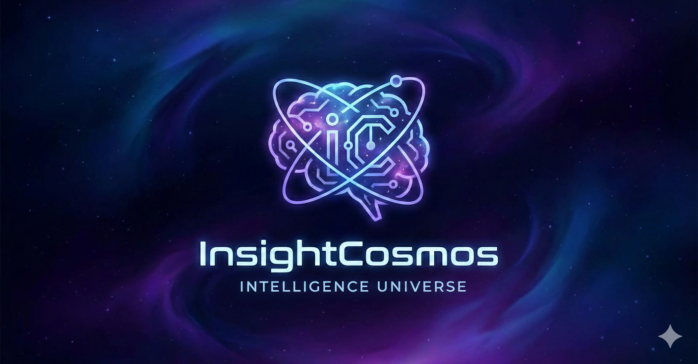

<p align="center">
  
</p>

<h1 align="center">InsightCosmos</h1>
<p align="center"><em>Personal AI Intelligence Universe</em></p>
<p align="center">Your Autonomous AI Agent for Daily & Weekly Intelligence Across AI + Robotics</p>

<p align="center">
  <a href="README.md">English</a> | <strong>繁體中文</strong>
</p>

---

InsightCosmos 是一個為個人打造的「宇宙級 AI 情報引擎」。  
它每天、每週自動從網路各處收集與分析 AI 與 Robotics 相關的重要資訊，並將：

- 🔍 自動蒐集（AI 掃描宇宙）
- 🧠 自主分析（AI 推理洞察）
- 🧩 結構化記憶（向量知識庫）
- 📬 智能報告（Daily / Weekly）

寄到你的 Email。

InsightCosmos 採用 **Google AI Agent 模型（Tools / Memory / Planning）**，  
以「多代理、多工具、自主推理」為核心，成為你的個人情報宇宙。

---

# 🌌 Features

## ✔ Daily Intelligence Digest（每日情報摘要）
- RSS + Google Search 自動抓取
- LLM 分析每篇內容的技術、趨勢、背景脈絡
- 根據「對 Ray 個人價值」排序
- 5–10 則最重要的宇宙事件寄 Email 給你

## ✔ Weekly Deep Report（每週深度情報）
- 分析本週全部內容的主題分布
- 推理 2–3 個本週 AI / Robotics 主趨勢
- 給出你（Ray）下一週可採行的行動建議

## ✔ Multi-Agent Architecture（Google Agent Style）
InsightCosmos 由 3 個核心代理組成：

1. **Scout Agent** – 資訊探索  
2. **Analyst Agent** – 技術洞察  
3. **Curator Agent** – 報告生成

（企業版則包含 Hunter、Learner、Coordinator Agent）

## ✔ Memory Layer（個人向量宇宙）
- SQLite 儲存資訊原文與分析內容
- Embedding 形成你的私人知識宇宙

## ✔ Lightweight, Local, Personal
- 單人開發、單人維護
- 不需要伺服器、不需要大型 DB
- 可在筆電或工作環境每天跑一次

---

# 🏗️ System Architecture

<p align="center">
  
</p>

---

# 📁 Project Structure

```
InsightCosmos/
├── src/
│   ├── agents/                    # AI 代理模組
│   │   ├── scout_agent.py         # 資訊探索代理
│   │   ├── analyst_agent.py       # 技術分析代理
│   │   ├── curator_daily.py       # 每日報告代理
│   │   └── curator_weekly.py      # 每週報告代理
│   │
│   ├── tools/                     # 工具函式庫
│   │   ├── fetcher.py             # RSS 抓取工具
│   │   ├── google_search_grounding.py    # Google Search Grounding
│   │   ├── content_extractor.py   # 內容萃取工具
│   │   ├── digest_formatter.py    # 報告格式化工具
│   │   ├── email_sender.py        # Email 發送工具
│   │   ├── trend_analysis.py      # 趨勢分析工具
│   │   └── vector_clustering.py   # 向量聚類工具
│   │
│   ├── memory/                    # 記憶層模組
│   │   ├── database.py            # SQLite 資料庫管理
│   │   ├── article_store.py       # 文章儲存管理
│   │   ├── embedding_store.py     # 向量儲存管理
│   │   ├── models.py              # 資料模型定義
│   │   └── schema.sql             # 資料庫結構
│   │
│   ├── orchestrator/              # 編排器模組
│   │   ├── daily_runner.py        # 每日流程編排
│   │   ├── weekly_runner.py       # 每週流程編排
│   │   └── utils.py               # 編排器工具函式
│   │
│   └── utils/                     # 通用工具
│       ├── config.py              # 配置管理
│       └── logger.py              # 日誌管理
│
├── prompts/                       # Prompt 模板
│   ├── analyst_prompt.txt         # 分析代理提示詞
│   ├── daily_prompt.txt           # 每日報告提示詞
│   ├── weekly_prompt.txt          # 每週報告提示詞
│   └── scout_prompt.txt           # 探索代理提示詞
│
├── tests/                         # 測試模組
│   ├── unit/                      # 單元測試
│   ├── integration/               # 整合測試
│   └── evaluation/                # 評估測試
│
├── docs/                          # 文件目錄
│   ├── planning/                  # 規劃文件
│   ├── implementation/            # 實作文件
│   └── optimization/              # 優化紀錄
│
├── data/                          # 資料儲存
│   └── insights.db                # SQLite 資料庫
│
├── scripts/                       # 執行腳本
├── requirements.txt               # Python 依賴
├── .env.example                   # 環境變數範本
└── README.md                      # 專案說明
```

---

# ⚙️ Setup

## System Requirements

- Python 3.10+（建議 3.11 或 3.13）
- 至少 4GB RAM
- 穩定的網路連線
- Google Gemini API Key

## Install

```bash
# 1. Clone 專案
git clone https://github.com/your-repo/InsightCosmos.git
cd InsightCosmos

# 2. 創建虛擬環境
python -m venv venv
source venv/bin/activate  # Linux/Mac
# 或 venv\Scripts\activate  # Windows

# 3. 安裝依賴
pip install -r requirements.txt

# 4. 配置環境變數
cp .env.example .env
# 編輯 .env 填入你的配置

# 5. 初始化資料庫
python -m src.memory.database

# 6. 測試運行（不發送郵件）
python -m src.orchestrator.daily_runner --dry-run
```

## Configure `.env`

```bash
# Google Gemini API (必需)
# 從 https://aistudio.google.com/apikey 取得
GOOGLE_API_KEY=your_gemini_api_key

# Email 配置 (必需)
EMAIL_ACCOUNT=your_email@gmail.com
EMAIL_PASSWORD=your_app_password  # 使用 Gmail App Password

# SMTP 設定（可選，預設 Gmail）
SMTP_HOST=smtp.gmail.com
SMTP_PORT=587

# 資料庫（可選，預設 data/insights.db）
DATABASE_PATH=data/insights.db

# 個人配置
USER_NAME=Ray
USER_INTERESTS=AI,Robotics,Multi-Agent Systems

# 日誌級別
LOG_LEVEL=INFO
```

> **Gmail App Password**: 前往 [Google 帳戶安全性](https://myaccount.google.com/security) → 兩步驟驗證 → 應用程式密碼

---

# 📬 Usage

## Daily Pipeline（每日情報）

每日 Pipeline 執行三個階段：
1. **Scout Agent**: 從 RSS 和 Google Search 收集文章
2. **Analyst Agent**: 使用 LLM 分析文章、評分、提取洞察
3. **Curator Agent**: 生成並發送每日摘要郵件

```bash
# 生產模式（收集 + 分析 + 發送郵件）
python -m src.orchestrator.daily_runner

# 測試模式（不發送郵件）
python -m src.orchestrator.daily_runner --dry-run

# 詳細日誌模式
python -m src.orchestrator.daily_runner --verbose
```

| 階段 | 預估時間 |
|------|----------|
| Scout (收集) | 30-60 秒 |
| Analyst (分析) | 1-3 分鐘 |
| Curator (報告) | 10-30 秒 |
| **總計** | **2-5 分鐘** |

## Weekly Pipeline（週報趨勢）

週報 Pipeline 分析一週的文章，進行主題聚類和趨勢識別。

```bash
# 生產模式
python -m src.orchestrator.weekly_runner

# 測試模式
python -m src.orchestrator.weekly_runner --dry-run

# 指定日期範圍
python -m src.orchestrator.weekly_runner --week-start 2025-11-18 --week-end 2025-11-24
```

| 項目 | 說明 |
|------|------|
| 主題群集 | 將文章按相似度分成 3-7 個主題群 |
| 熱門趨勢 | 出現頻率高、優先度高的關鍵字 |
| 新興話題 | 低頻但高優先度的新興關鍵字 |

---

# ⏰ Automation

## Linux/Mac (Cron)

```bash
# 編輯 crontab
crontab -e

# 每天早上 8 點執行日報
0 8 * * * cd /path/to/InsightCosmos && /path/to/venv/bin/python -m src.orchestrator.daily_runner >> logs/daily.log 2>&1

# 每週日晚上 8 點執行週報
0 20 * * 0 cd /path/to/InsightCosmos && /path/to/venv/bin/python -m src.orchestrator.weekly_runner >> logs/weekly.log 2>&1
```

## Windows Task Scheduler

1. 開啟 Task Scheduler
2. 創建基本任務，設定觸發器（每天早上 8 點）
3. 設定動作：
   - **Program**: `C:\path\to\InsightCosmos\venv\Scripts\python.exe`
   - **Arguments**: `-m src.orchestrator.daily_runner`
   - **Start in**: `C:\path\to\InsightCosmos`

---

# 🎯 Customization

## 修改關注領域

編輯 `.env` 中的 `USER_INTERESTS`：

```bash
# 範例 1: AI 與機器人
USER_INTERESTS=AI,Robotics,Multi-Agent Systems

# 範例 2: LLM 專注
USER_INTERESTS=Large Language Models,Prompt Engineering,AI Agents,RAG

# 範例 3: 跨領域
USER_INTERESTS=AI,Healthcare,Drug Discovery,Medical Imaging
```

## 調整 RSS 來源

編輯 `src/agents/scout_agent.py` 中的 `DEFAULT_FEEDS`。

## 更換 LLM 模型

InsightCosmos 使用 Google ADK，支援多種 LLM：

| 場景 | 推薦模型 | 原因 |
|-----|---------|------|
| 成本優先 | Gemini 2.5 Flash | 最便宜，速度快 |
| 品質優先 | Claude 3.7 Sonnet | 推理能力強 |
| 平衡選擇 | GPT-4o | 速度與品質兼顧 |

---

# 📊 Performance

| 指標 | 目標 | 實際 |
|------|------|------|
| Daily Pipeline 執行時間 | < 5 分鐘 | 2-3 分鐘 |
| Weekly Pipeline 執行時間 | < 2 分鐘 | ~17 秒 |
| 單文章分析時間 | < 15 秒 | 3-5 秒 |
| 測試覆蓋率 | >= 95% | 97.4% |

---

# 🔧 Troubleshooting

## 無法發送郵件

確認使用 Gmail **App Password**（非帳號密碼）：
- Google 帳戶 → 安全性 → 兩步驟驗證 → 應用程式密碼

## Google Search Grounding 失敗

確認 API Key 有效且有足夠配額：[Google AI Studio](https://aistudio.google.com/apikey)

## 資料庫鎖定

確認沒有多個 Pipeline 同時運行：
```bash
ps aux | grep daily_runner
```

---

# 🚀 Roadmap

### v1.0（個人宇宙）✅
- Daily & Weekly Intelligence
- SQLite + Embedding Memory
- RSS + Google Search Tools
- Email 推送

### v2.0（智慧宇宙）
- 自動來源發現
- 主題偏好學習
- 趨勢聚類、持續追蹤
- 知識圖譜（Knowledge Nebula）

### v3.0（企業宇宙）
- 多代理完整架構
- Hunter / Learner / Coordinator
- SaaS Intelligence Platform

---

# 📚 Documentation

- [USER_MANUAL.md](USER_MANUAL.md) - Complete User Manual (English)
- [USER_MANUAL_zh_TW.md](USER_MANUAL_zh_TW.md) - 完整使用手冊（繁體中文）
- [CLAUDE.md](CLAUDE.md) - Claude Code 專案指南
- [PROGRESS.md](PROGRESS.md) - 開發進度追蹤
- `docs/planning/` - 規劃文件
- `docs/implementation/` - 實作文件

---

# ✨ Slogan

> "Your Personal Intelligence Universe."

---

# ✨ Author

**Ray Chang**
InsightCosmos Project
Personal AI Intelligence Universe

---

# 📄 License

MIT License
